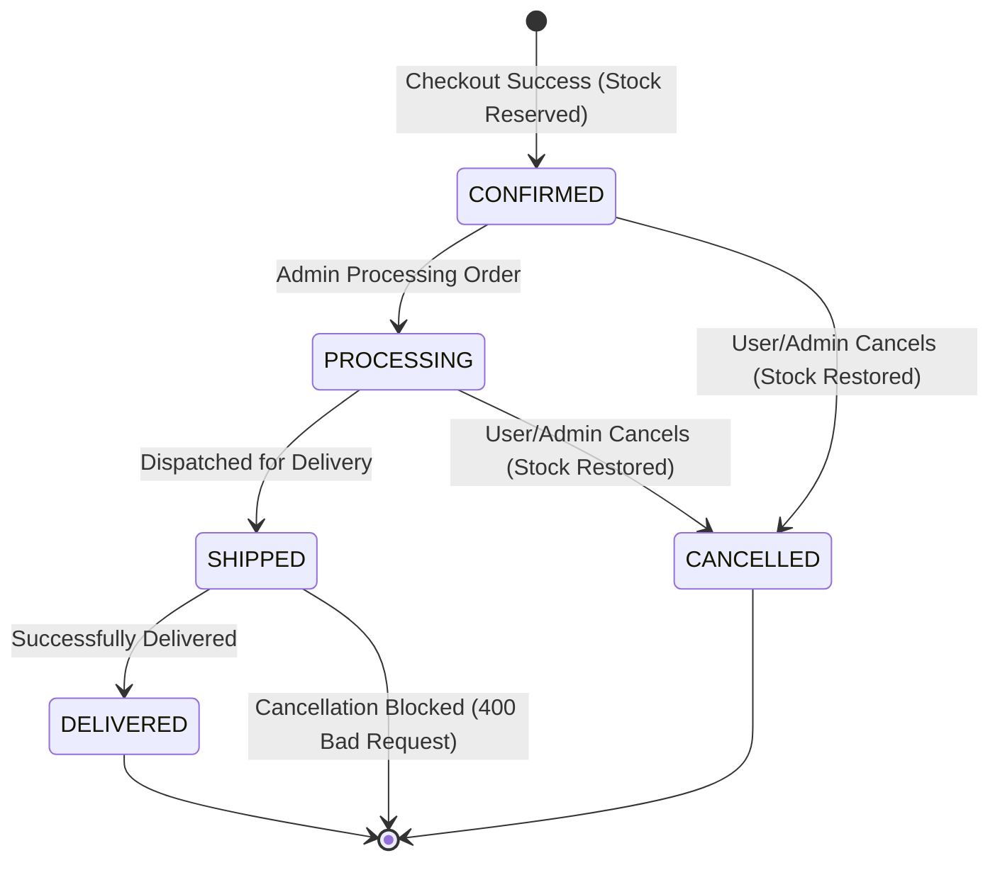
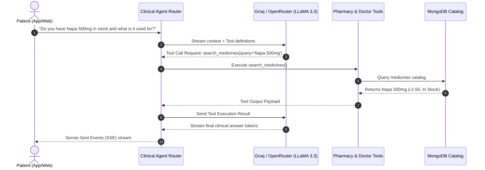

# 🏥 MediTouch — Telemedicine & E-Pharmacy Core API Engine

<div align="center">


<p align="center">
  <b>Production-grade, asynchronous backend powering modern healthcare, real-time telemedicine video consultations, concurrency-safe e-pharmacy ordering, and autonomous clinical AI agent workflows.</b>
</p>

[Key Features](#-key-features) •
[Architecture](#-system-architecture) •
[E-Pharmacy & Stock Engine](#-concurrency-safe-e-pharmacy-engine) •
[Clinical AI Agent](#-autonomous-clinical-ai-agent) •
[API Reference](#-api-endpoints--modules) •

</div>

---

## 🌟 Key Features

### 🛒 Concurrency-Safe E-Pharmacy & Order Lifecycle
- **Atomic Stock Reservation**: Prevents overselling during high-concurrency checkout rushes with atomic MongoDB conditional decrements (`$inc: {stock_count: -qty}`) and mutex protection.
- **Compensating Rollbacks**: If item $N$ in a multi-item cart fails inventory validation, items $1 \dots N-1$ are automatically and atomically refunded.
- **Strict State-Machine Lifecycle**: Enforces `CONFIRMED` $\to$ `PROCESSING` $\to$ `SHIPPED` $\to$ `DELIVERED` $\to$ `CANCELLED`.
- **Protected Cancellations**: Users and admins can cancel orders only prior to `SHIPPED` status; cancellation atomically restores inventory counts.
- **Real-Time Admin PubSub (SSE)**: Built-in `OrderEventBroadcaster` pushes instant order status updates and creations to the admin dashboard over Server-Sent Events with zero polling overhead.

### 🩺 Telemedicine & Live Video Consultations
- **Doctor Schedule & Slot Generator**: Automated generation of bookable consultation slots with buffer times and active lockouts.
- **ZEGOCLOUD WebRTC Video Rooms**: Ephemeral secure token generation for end-to-end encrypted doctor-patient video appointments.
- **Digital Prescriptions**: Structured clinical monograph and diagnosis builder with PDF export and Cloudinary CDN attachment storage.

### 🤖 Multi-Provider Autonomous Clinical AI Agent
- **Dynamic Multi-Provider Fallback**: Real-time routing across ultra-low-latency providers (**Groq** `llama-3.3-70b-versatile` with automatic failover to **OpenRouter** free/premium tiers).
- **Intelligent Tool-Calling Suite**:
  - `search_medicines`: Fuzzy matching over drugs, dosage forms, brands, and generics.
  - `get_medicine_details`: Clinical monographs (indications, pharmacology, dosage, side effects, contraindications).
  - `check_medicine_stock`: Live inventory availability and pricing checks.
  - `search_doctors`: Specialty, chamber, and fee lookup.
  - `check_doctor_availability`: Real-time calendar slot queries.
- **Interactive Clarification Dialogs**: Solicits missing symptoms/data before providing triage advice.
- **Streaming SSE Chat**: Token-by-token response streaming directly to web and mobile clients.

### 💳 Financial & Media Integrations
- **bKash Tokenized Payment Gateway**: Complete lifecycle support (`createPayment`, `executePayment`, `queryPayment`, `refundPayment`) with webhook listeners.
- **Cloudinary CDN**: Automated media compression, prescription scanning, and secure asset hosting.
- **SMTP Email Notifications**: HTML transactional emails for account activation, password resets, and order invoices.

---

## 📐 System Architecture

The backend is built following a clean, layered architectural pattern prioritizing separation of concerns, testability, and asynchronous performance.

```mermaid
flowchart TD
    Client[📱 Flutter Mobile App & 🌐 Next.js Admin Panel]

    subgraph "MediTouch Gateway & Middleware"
        CORS[CORS & Security Middleware]
        Context[Request Context & Correlation IDs (x-request-id)]
        AuthGuard[JWT & RBAC Security Guard]
    end

    subgraph "FastAPI Application Core"
        AuthRouter["/api/v1/auth"]
        OrderRouter["/api/v1/orders"]
        PharmRouter["/api/v1/pharmacy"]
        ConsultRouter["/api/v1/consultations"]
        AgentRouter["/api/v1/chat"]
        AdminRouter["/api/v1/admin"]
    end

    subgraph "Service & Domain Layer"
        OrderSvc[Order & Checkout Service<br/>• Concurrency Locks<br/>• Compensating Rollbacks]
        SSEBroadcaster[Order Event Broadcaster<br/>• Real-time SSE PubSub]
        AgentSvc[Clinical Agent Orchestrator<br/>• Multi-Provider LLM Fallback]
        PharmSvc[Pharmacy & Monograph Service]
        ConsultSvc[Consultation & ZEGOCLOUD Service]
    end

    subgraph "Data Storage & External Services"
        MongoDB[(🍃 MongoDB Atlas / Local<br/>Motor Async Driver)]
        Groq["⚡ Groq / OpenRouter API"]
        bKash["💳 bKash Gateway"]
        ZEGO["📹 ZEGOCLOUD Video Engine"]
        Cloudinary["☁️ Cloudinary CDN"]
    end

    Client --> CORS --> Context --> AuthGuard
    AuthGuard --> AuthRouter & OrderRouter & PharmRouter & ConsultRouter & AgentRouter & AdminRouter

    OrderRouter --> OrderSvc
    OrderSvc --> SSEBroadcaster
    OrderSvc --> MongoDB
    PharmRouter --> PharmSvc --> MongoDB
    ConsultRouter --> ConsultSvc --> ZEGO & MongoDB
    AgentRouter --> AgentSvc --> Groq
    AgentSvc --> PharmSvc & MongoDB
```

---

## 🔒 Concurrency-Safe E-Pharmacy Engine

### 1. Atomic Stock Reservation Pattern
During checkout, the system acquires an in-memory async mutex and executes atomic MongoDB conditional decrements:

```python
# Atomic decrement with stock floor condition
updated = await db.medicines.find_one_and_update(
    {"id": item.medicine_id, "stock_count": {"$gte": item.quantity}},
    {"$inc": {"stock_count": -item.quantity}},
    return_document=ReturnDocument.AFTER
)

if not updated:
    raise OutOfStockException(f"'{item.name}' has insufficient stock.")
```

### 2. Multi-Item Compensating Rollback
If any item in the cart fails inventory reservation, all previously decremented items are immediately restored in reverse order:

```python
except Exception as ex:
    for med_id, qty in decremented_items:
        await db.medicines.update_one(
            {"id": med_id},
            {"$inc": {"stock_count": qty}, "$set": {"in_stock": True}}
        )
    raise ex
```

### 3. State Machine Order Lifecycle



---

## 🤖 Autonomous Clinical AI Agent

The clinical AI agent is powered by a multi-provider fallback engine featuring tool-calling capabilities and streaming responses:



---

## 📁 Directory Structure

```text
backend/
├── app/
│   ├── background/             # Background schedulers, cleaners & workers
│   │   ├── crawler_daemon.py   # Automated medicine monograph crawler
│   │   └── scheduler.py        # Expired session & appointment cleanup
│   ├── common/                 # Shared domain enums, responses & pagination
│   │   ├── enums.py            # UserRole, OrderStatus, AppointmentStatus
│   │   ├── pagination.py       # Reusable pagination parameters & metadata
│   │   └── responses.py        # Generic APIResponse[T] envelope
│   ├── core/                   # Infrastructure configuration & security
│   │   ├── config.py           # Pydantic v2 BaseSettings
│   │   ├── database.py         # Database utilities
│   │   ├── exceptions.py       # Standardized domain exceptions & handlers
│   │   ├── logging.py          # Structured JSON & console logger
│   │   ├── middleware.py       # Request context & request-id tracking
│   │   └── security.py         # Passlib bcrypt hashing & PyJWT tokens
│   ├── db/                     # MongoDB persistence layer
│   │   ├── indexes.py          # Automatic index definitions
│   │   └── mongodb.py          # Motor async client & connection manager
│   ├── integrations/           # Third-party service clients
│   │   ├── bkash/              # bKash tokenized payment gateway
│   │   ├── cloudinary/         # Cloudinary CDN client
│   │   └── medeasy_parser/     # Medicine crawler & scraper ingestion
│   ├── modules/                # Feature modules (Controller-Service-Repository)
│   │   ├── admin/              # Platform administration & analytics
│   │   ├── agent/              # Autonomous AI agent, tools & LLM fallback
│   │   ├── appointments/       # Doctor appointment scheduling & booking
│   │   ├── audit/              # Security and operational audit logging
│   │   ├── auth/               # Authentication, registration & tokens
│   │   ├── consultations/      # ZEGOCLOUD video sessions & prescriptions
│   │   ├── doctors/            # Doctor profiles, chambers & slot generator
│   │   ├── media/              # File uploads & CDN dispatch
│   │   ├── notifications/      # Push notifications & transactional emails
│   │   ├── orders/             # Cart, checkout, atomic stock & SSE broadcaster
│   │   ├── pharmacy/           # Medicine catalog & crawler management
│   │   └── users/              # User profiles & address book
│   └── main.py                 # FastAPI app entrypoint, lifespan & CORS
├── tests/                      # Pytest automated test suites
│   ├── test_orders_and_inventory.py   # Concurrency race conditions & rollbacks
│   ├── test_agent_security_rbac.py    # Agent tool RBAC validation
│   └── test_response_assembler.py     # Stream response assembler tests
├── logs/                       # Application runtime logs
├── requirements.txt            # Production dependencies
├── pytest.ini                  # Pytest configuration
└── .env.example                # Sample environment template
```

---

## 🚀 API Endpoints & Modules

| Module | Prefix | Key Endpoints | Description |
| :--- | :--- | :--- | :--- |
| **Authentication** | `/api/v1/auth` | `POST /register`, `POST /login`, `POST /refresh`, `POST /logout` | Secure JWT authentication with role authorization |
| **Users & Addresses** | `/api/v1/users` | `GET /profile`, `PUT /profile`, `GET /addresses`, `POST /addresses` | User profile & reusable address management |
| **Doctors** | `/api/v1/doctors` | `GET /`, `GET /{id}`, `GET /specialties`, `GET /{id}/slots` | Doctor discovery, chamber slots & scheduling |
| **Appointments** | `/api/v1/appointments` | `GET /`, `POST /book`, `PUT /{id}/status`, `POST /{id}/cancel` | Appointment booking & status lifecycle |
| **Consultations** | `/api/v1/consultations` | `GET /{id}`, `POST /{id}/token`, `POST /{id}/prescription` | ZEGOCLOUD room tokens & prescription builder |
| **Pharmacy** | `/api/v1/pharmacy` | `GET /medicines`, `GET /medicines/{slug_or_id}/details`, `GET /categories`, `GET /stats` | E-pharmacy catalog, monographs & search |
| **Orders & Cart** | `/api/v1/orders` | `GET /cart`, `POST /cart/items`, `POST /checkout`, `GET /my-orders`, `GET /admin/stream` | Atomic cart checkout, tracking & real-time SSE |
| **AI Agent** | `/api/v1/chat` | `POST /sessions`, `POST /stream`, `POST /clarifications/submit` | Streaming LLM assistant with live tool execution |
| **Payments** | `/api/v1/payments` | `POST /bkash/create`, `POST /bkash/execute`, `GET /bkash/callback` | bKash tokenized gateway flows |
| **Admin & Control** | `/api/v1/admin` | `GET /dashboard/stats`, `GET /orders/stream`, `POST /pharmacy/crawler/start` | Real-time administrative controls & crawler |
| **Health** | `/health` | `GET /health` | Service uptime and database connectivity probe |

---

## 🧪 Testing & Verification

The backend includes comprehensive unit, integration, and stress test suites powered by `pytest` and `pytest-asyncio`.

```bash
# Run the entire test suite
pytest

# Run orders, inventory concurrency, and rollback tests
pytest tests/test_orders_and_inventory.py -v

# Run AI agent security & RBAC tests
pytest tests/test_agent_security_rbac.py -v
```

### Sample Automated Test Output:
```text
============================= test session starts =============================
platform win32 -- Python 3.14.6, pytest-9.1.1
collected 3 items

tests/test_orders_and_inventory.py::test_atomic_stock_reservation_race_condition PASSED [ 33%]
tests/test_orders_and_inventory.py::test_order_cancellation_lifecycle_and_stock_restoration PASSED [ 66%]
tests/test_orders_and_inventory.py::test_admin_realtime_broadcaster PASSED [100%]

============================== 3 passed in 0.52s ==============================
```

---

## 🔐 Security & Reliability Highlights

- **CORS Defense**: Explicit configurable origins with credential handling.
- **SQL/NoSQL Injection Immunity**: Parameterized Pydantic schemas and regex escaping.
- **Correlation ID Tracking**: Every request is assigned a unique `x-request-id` propagated across logs.
- **Graceful Lifespan Management**: Asynchronous connection pooling with clean connection disposal during graceful shutdowns.
- **Zero-Polling Admin Feeds**: High-performance SSE streams with heartbeat ping keepalives prevent network congestion.

---

<div align="center">
  <sub>Built with ❤️ for the MediTouch Healthcare Ecosystem.</sub>
</div>
